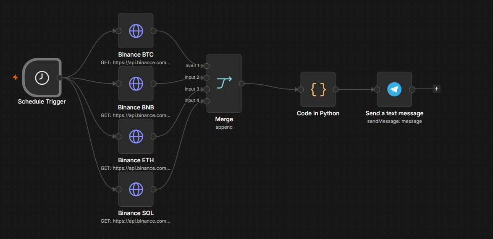
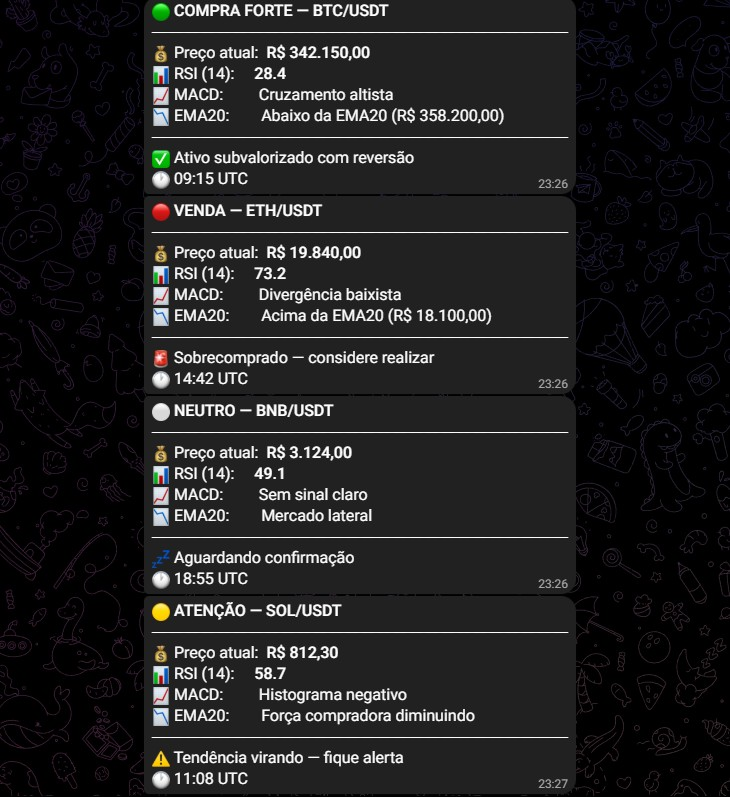

# 🤖 CryptoBot Analizer

> Robô automatizado que monitora o mercado de criptomoedas **24 horas por dia**, analisando indicadores técnicos e enviando sinais de **COMPRA**, **VENDA** ou **NEUTRO** direto no Telegram — para BTC, ETH, SOL e BNB.

---

## 📌 Sobre o Projeto

Este projeto nasceu de uma necessidade real: um familiar meu acompanhava o mercado cripto manualmente todos os dias, tentando identificar o melhor momento para entrar ou sair de posições. O processo era cansativo, sujeito a erros emocionais e impossível de manter 24 horas por dia.

A solução foi automatizar toda essa análise. O robô roda de hora em hora, coleta dados reais da Binance, calcula os indicadores técnicos e entrega um sinal claro diretamente no Telegram.

---

## ✅ O que o robô faz de verdade

- Busca os últimos 30 candles de cada ativo direto na **API pública da Binance**
- Calcula **RSI**, **MACD** e **EMA20** com código Python puro
- Classifica cada ativo como 🟢 COMPRA, 🔴 VENDA, 🟡 ATENÇÃO, 🔵 QUEDA INTENSA ou ⚪ NEUTRO
- Envia o sinal formatado via **Telegram Bot** a cada **1 hora**
- Funciona 24h no ar usando o **n8n** como orquestrador

---

## 🔧 Fluxo de Automação no n8n



O fluxo roda a cada 30 Minutos e funciona assim:

```
Gatilho (1h) → Binance BTC ─┐
              Binance BNB ──┤
              Binance ETH ──┼→ Fusão → Código Python → Telegram
              Binance SOL ──┘
```

1. O gatilho dispara a cada 30 Minutos
2. 4 nós buscam os candles de cada ativo na API da Binance simultaneamente
3. O nó Fusão une os 120 itens (30 candles × 4 moedas)
4. O código Python calcula os indicadores e monta os sinais
5. O Telegram Bot envia as 4 mensagens

---

## 📬 Sinais no Telegram



Cada mensagem entregue no Telegram tem este formato:

```
🟢 COMPRA FORTE — BTC/USDT
━━━━━━━━━━━━━━━━━━━━━━━━━━
💰 Preço atual:  R$ 342.150,00
📊 RSI (14):     28.4
📈 MACD:         Cruzamento altista
📉 EMA20:        Abaixo da EMA20 (R$ 358.200,00)
━━━━━━━━━━━━━━━━━━━━━━━━━━
✅ Ativo subvalorizado com reversão
🕐 09:15 UTC
```

---

## 🪙 Ativos Monitorados

| Ativo | Par | Exchange |
|-------|-----|----------|
| Bitcoin | BTC/USDT | Binance |
| BNB | BNB/USDT | Binance |
| Ethereum | ETH/USDT | Binance |
| Solana | SOL/USDT | Binance |

---

## 📊 Indicadores Utilizados

| Indicador | O que detecta |
|-----------|--------------|
| **RSI** (14 períodos) | Sobrecompra (>65) e sobrevenda (<35) |
| **MACD** | Direção e força da tendência |
| **EMA20** | Média móvel exponencial para confirmar tendência |

---

## 🧠 Lógica de Sinais

```
RSI < 25                                       → 🔵 QUEDA INTENSA
RSI < 35  + preço abaixo da EMA20 + MACD > 0  → 🟢 COMPRA FORTE
50 < RSI < 65 + MACD < 0                      → 🟡 ATENÇÃO
RSI > 65  + preço acima da EMA20 + MACD < 0   → 🔴 VENDA
Nenhuma condição acima                         → ⚪ NEUTRO
```

---

## 🗂️ Arquivos do Repositório

```
cryptobot-analyzer/
│
├── analise.py              # Código Python com RSI, MACD, EMA20 e lógica de sinais
├── README.md               # Este arquivo
└── screenshots/
    ├── N8N-AUTOMACAO.jpg   # Print do fluxo no n8n
    └── Print-TELEGRAM.jpg  # Print dos sinais chegando no Telegram
```

---

## 🛠️ Tecnologias


---

## ⚠️ Aviso Legal

> Este projeto é exclusivamente para fins **educacionais e de portfólio**.
> Os sinais gerados **não constituem recomendação de investimento**.
> Criptomoedas são ativos de alto risco. **Nunca invista mais do que pode perder.**

---

<p align="center">
  Feito com ❤️ por <strong>Isaque Rocha</strong>
</p>
